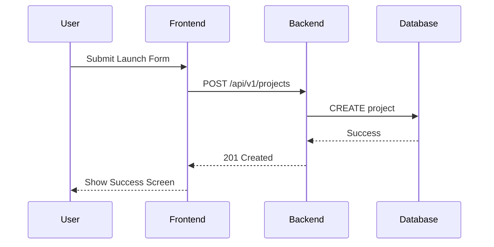

# Goal
To visualize the structural and behavioral aspects of the Startup LaunchPad system, facilitating clear communication between stakeholders and developers.

# Step-by-Step Logic
1. **Identify Entities/Processors**: Determine what major data entities and processes exist (e.g., User, Startup, Investment, Payment Gateway).
2. **Choose the Right Diagram**:
   - Use **Mermaid** for sequence diagrams and simple flowcharts directly in Markdown.
   - Use **Draw.io** for complex, high-fidelity Entity Relationship Diagrams (ERD) and multi-level Data Flow Diagrams (DFD).
3. **Drafting (Iteration 1)**: Outline the connections and data flows.
4. **Refining (Iteration 2)**: Add attributes to ERD entities and define data formats for DFD flows.
5. **Consistency Check**: Ensure diagram versions match the current code implementation.

# Technical Constraints
- **Mermaid**: Use standard GitHub Flavored Markdown syntax.
- **Draw.io**: Export as `.drawio.svg` or `.png` with embedded XML for future editing.
- **DFD Levels**: Maintain hierarchy from Level 0 (Context) to Level 2 (Detailed).

# Code Patterns

# Tool Integration
- **Draw.io**: Access via `app.diagrams.net` or VS Code extension. Use the "Software Design" shape library for standardized symbols.
- **Google Search**: Find specific Mermaid syntax for complex diagrams like Gantt charts or Class diagrams.
- **Figma**: Reference Figma app flows to inform sequence diagram logic.
